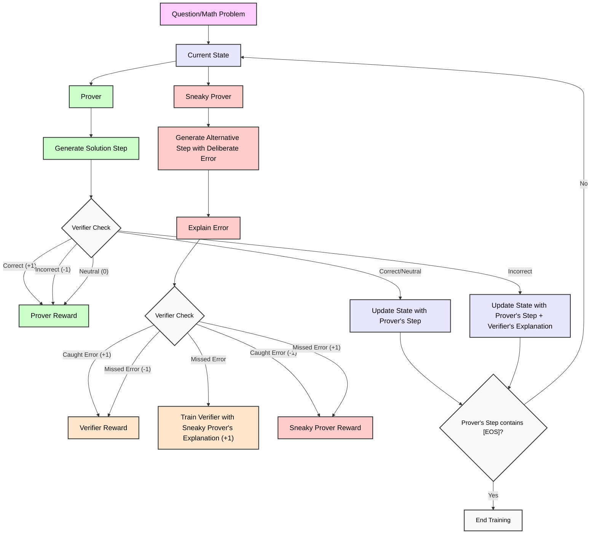

# How it works?

# To do:
1. Finish the selfplay.py file:
   - ~~add stop tokens for the critic~~
   - ~~make the models actually load (I think we can use the same base model for all of those)~~
   - ~~make the loop run until the prover finished solving the question~~
   - verify if there aren't any errors in the code
2. Figure out a way how to make the model split the task into more steps (original prover-verifier games paper does that so maybe we can find some useful info there)
3. Add final solutions verification too (maybe at start we can use some better llm, later we would have to do something else, we could also verify some solutions by ourselves, especially the ones that the critic wasn't fully certain about)
4. Make a dataset with increasingly harder questions

## Long term:
1. How to improve the model in the domains without easily verifiable ground truth?

